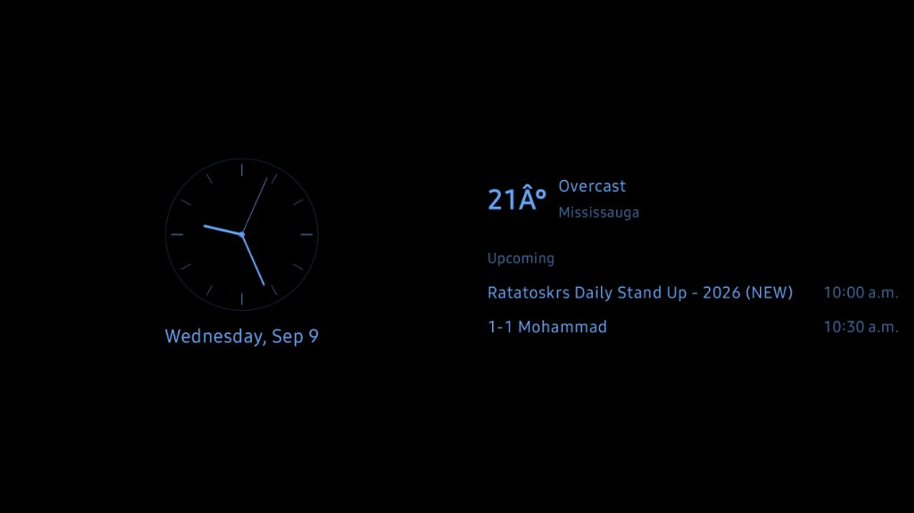
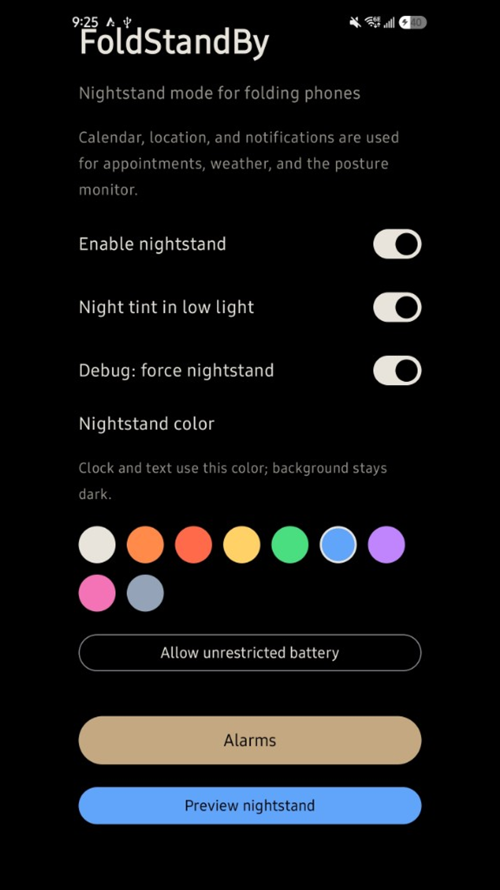
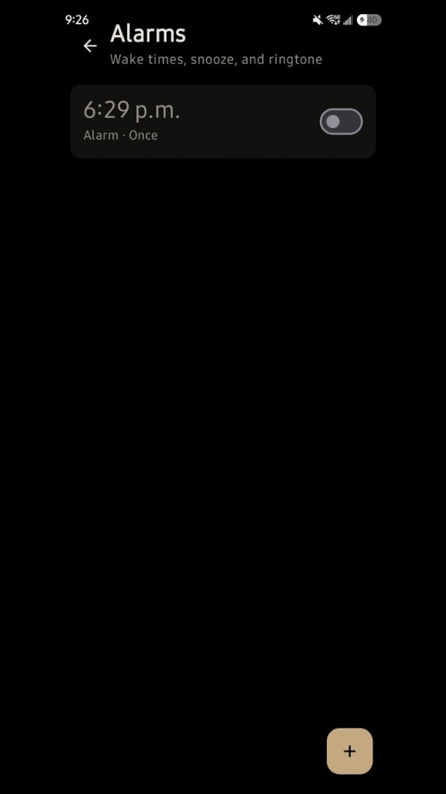
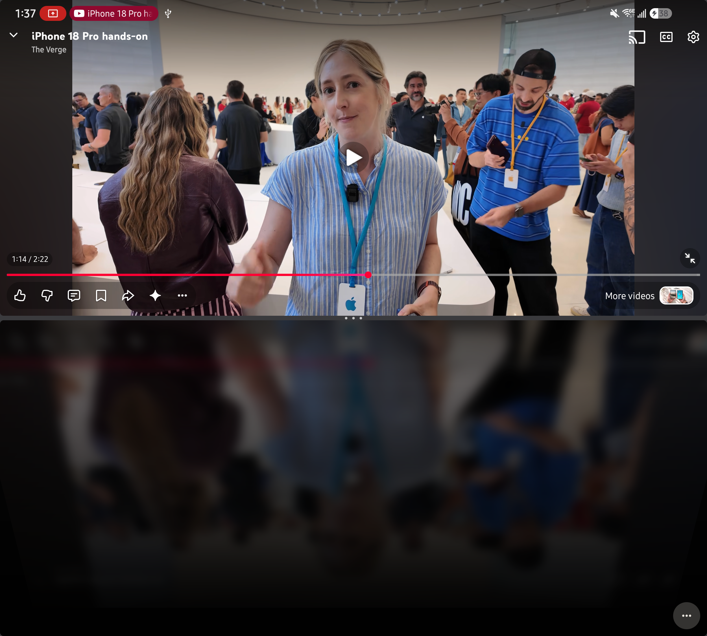
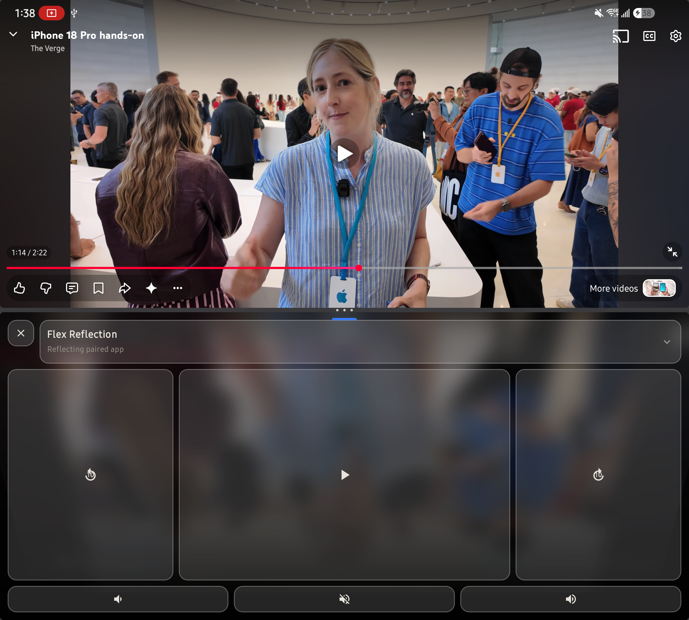

# FoldStandBy

Nightstand mode for Android folding phones — inspired by iPhone StandBy.

When enabled, FoldStandBy watches for **tent posture** (book-style folds) or a **closed Flip cover** display while the device is locked, then shows a dim always-on screen with:

- Analog clock
- Date
- Local weather (Open-Meteo)
- Upcoming calendar appointments
- Next alarm status (StandBy-style)

Tap anywhere (when not ringing) to dismiss and return to the system lock screen.

## Screenshots

### Nightstand



### Setup

<p>
  
  &nbsp;
  
</p>

### Flex Reflection (Z Fold tabletop)

Ambient mirror of a paired video app on the lower half:



Media controls over frosted glass:



## Alarms

1. Open the app → **Alarms**.
2. Add an alarm: time, repeat days, snooze (1–15 min), ringtone, vibrate.
3. Grant **exact alarms** if prompted (required for reliable locked wake-ups).
4. When the alarm fires, the nightstand shows large **Snooze** / **Stop** controls.

## Requirements

- Android 12+ (`minSdk 31`)
- Foldable recommended (Pixel Fold, Galaxy Z Fold/Flip, etc.)
- JDK 17 for builds

## Build

```bash
./gradlew :app:assembleDebug
```

On Windows:

```bat
gradlew.bat :app:assembleDebug
```

Install:

```bat
adb install -r app\build\outputs\apk\debug\app-debug.apk
```

## Setup on device

1. Open **FoldStandBy** and grant calendar, location, and notification permissions.
2. Prefer **Allow unrestricted battery** so the posture monitor is not killed.
3. Enable **Enable nightstand**.
4. Configure at least one alarm and allow exact alarms.
5. Place the phone in tent mode (Fold) or fold closed to the cover (Flip) and lock the screen.

### Emulator / non-fold testing

Turn on **Debug: force nightstand** to launch the nightstand UI without fold hardware. Use **Preview nightstand** for a one-shot look at the UI.

## Flex Reflection (Z Fold tabletop)

1. Create an **App Pair**: video app (YouTube, Gallery, etc.) on top + FoldStandBy on the bottom.
2. Fold into **tabletop** (half-open, horizontal hinge).
3. Open FoldStandBy → **Reflections** → **Open Flex Reflection** → **Start capture**.
4. In the system picker, choose the **paired video app window** (not the entire screen).
5. The lower half shows a mirrored, blurred ambient reflection of that app.
6. Optional: enable **notification access** so skip / play controls can drive the paired player.

DRM / `FLAG_SECURE` streams (many Netflix titles) cannot be captured and appear black.

## Architecture notes

- `PostureMonitorService` — foreground service (`specialUse`) observing hinge/gravity/fold posture and keyguard state.
- `NightstandActivity` — `showWhenLocked` + `turnScreenOn`, `FLAG_KEEP_SCREEN_ON`, window brightness ~8%. Does **not** dismiss the keyguard.
- `AlarmScheduler` / `AlarmReceiver` — `AlarmManager.setAlarmClock` for exact wake while locked.
- Adaptive layouts use width classes (`<600` / `600–840` / `>840`) for setup/alarms; nightstand tunes for cover-narrow (`<420dp`) and fold-aware padding.
- Flex Reflection uses `MediaProjection` + frosted media controls on the lower App Pair pane.

## Play policy note

The posture monitor uses `foregroundServiceType="specialUse"`. If you publish on Play, declare the special-use justification (monitoring foldable tent/cover posture for a lock-screen nightstand). Alarm apps should also declare exact-alarm use.
